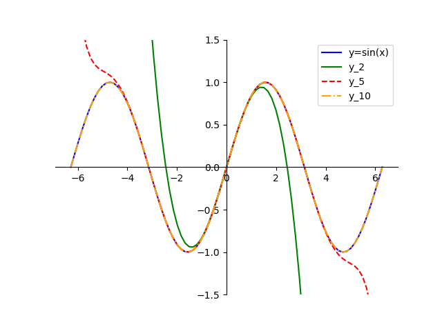

# 数值实验作业（第一章）

## P14. 2

利用级数
$$
\frac{\pi}{4}=1-\frac{1}{3}+\frac{1}{5}-\frac{1}{7}+\cdots
$$
计算无理数$\pi$的近似值。由于交错级数的部分和数列$S_N$在级数的和上下摆动，截断误差将小于第一个被舍弃的项$\left|a_{n+1}\right|$. 试分析：若要使截断误差小于$10^{-4}$或$10^{-8}$，应该取多少项求和？并分别计算$\pi$的近似值。

### 实验内容、步骤及结果

由于截断误差将小于第一个被舍弃的项$\left|a_{n+1}\right|$，易编程实现：

```python
def is_term_less_than(n, threshold):
    term = (-1) ** n / (2 * n + 1)
    return abs(term) < threshold


def calculate_series(n):
    series_sum = .0
    for i in range(n):
        term = (-1) ** i / (2 * i + 1)
        series_sum += term
    return series_sum


def main():
    expected_trunc_errs = [1e-4, 1e-5, 1e-6, 1e-8]
    for trunc_err in expected_trunc_errs:
        print(f'期望截断误差为{trunc_err}')
        n = 0
        while not is_term_less_than(n, trunc_err):
            n += 1
        print(f'需要计算{n}项')
        print(f'π的近似值为{4 * calculate_series(n)}')


if __name__ == '__main__':
    main()
```

### 实验结果分析

```
期望截断误差为0.0001
需要计算5000项
π的近似值为3.141392653591791
期望截断误差为1e-05
需要计算50000项
π的近似值为3.1415726535897814
期望截断误差为1e-06
需要计算500000项
π的近似值为3.141590653589692
期望截断误差为1e-08
需要计算50000000项
π的近似值为3.1415926335902506
```

随截断误差减小，$\pi$的估计值越精确，但计算项数也随之增大。

## P14. 3

在同一坐标系下，利用plot函数画出函数
$$
y=\sin x, y_n=\sum_{i=0}^n(-1)^i \frac{x^{2 i+1}}{(2 i+1)!}, \quad(n=2,5,10)
$$
的图形，并加标注说明各条曲线的含义。

### 实验内容、步骤及结果

```python
import math
import numpy as np
import matplotlib.pyplot as plt
from decimal import Decimal, getcontext

getcontext().prec = 50

x = np.linspace(-2 * np.pi, 2 * np.pi, 80)

y = np.sin(x)


def taylor_series(x, n):
    result = np.zeros_like(x, dtype=np.float64)
    for i in range(n + 1):
        result += ((-1) ** i) * (x ** (2 * i + 1)) / float(Decimal(math.factorial(2 * i + 1)))
    return result


y_2 = taylor_series(x, 1)
y_5 = taylor_series(x, 5)
y_10 = taylor_series(x, 10)

plt.plot(x, y, label='y=sin(x)', color='blue')
plt.plot(x, y_2, label='y_2', color='green')
plt.plot(x, y_5, label='y_5', color='red', linestyle='--')
plt.plot(x, y_10, label='y_10', color='orange', linestyle='-.')

plt.ylim(-1.5, 1.5)

ax = plt.gca()
ax.spines['left'].set_position('center')
ax.spines['bottom'].set_position('center')

ax.spines['right'].set_color('none')
ax.spines['top'].set_color('none')

ax.xaxis.set_ticks_position('bottom')
ax.yaxis.set_ticks_position('left')

plt.legend()

plt.show()
```

### 实验结果分析



当$x\to 0$时，用泰勒展开近似$\sin x$的截断误差较小。随着$x$增大，截断误差越明显。
