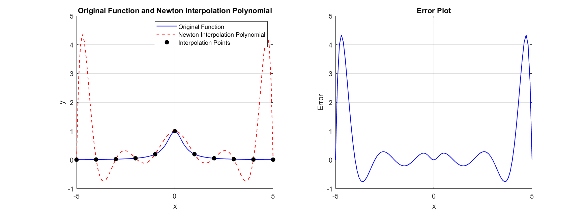
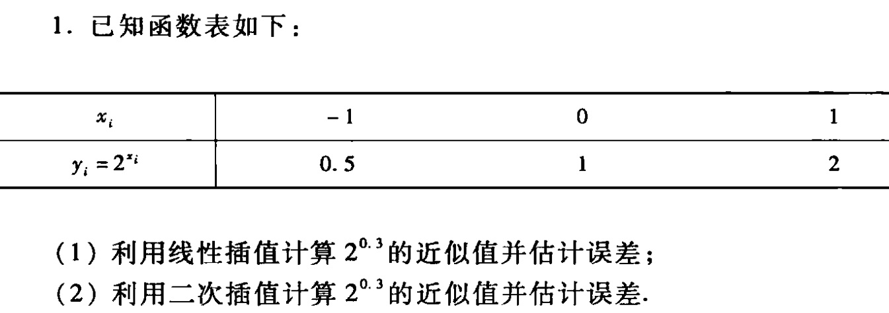
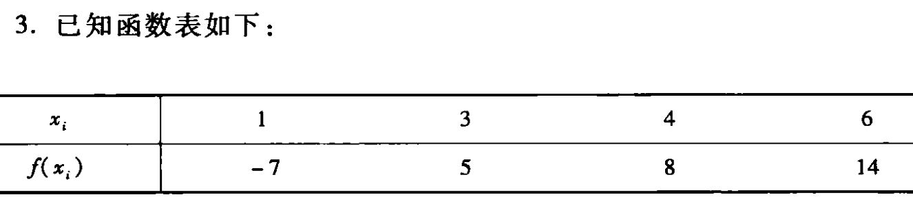
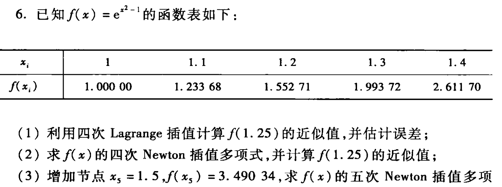
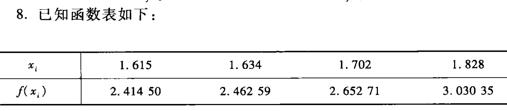
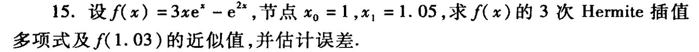

# 数值实验作业（第五章）

> 代码仓库：https://github.com/sylvanding/bit-numerical-analysis-hw

## P175. Q1

试编写MATLAB函数实现Newton插值，要求能输出插值多项式。对函数$f(x)=\frac{1}{1+4x^2}$在区间$[-5,5]$上实现10次多项式插值。

1. 输出插值多项式；
2. 在区间$[-5,5]$内均匀插入99个结点，计算这些节点上函数$f(x)$的近似值，并在同一张图中画出原函数和插值多项式的图形；
3. 观察龙格现象，计算插值函数在各节点上的误差，并画出误差图。

### 实验内容、步骤及结果

chap-5\divided_difference.m: 

```matlab
function dd_table = divided_difference(x, y)
    
    assert(numel(x) == numel(y), 'x and y must have the same number of elements');

    % Number of data points
    n = length(x);

    % Initialize the divided difference table
    dd_table = zeros(n, n);

    % First column is y values
    dd_table(:, 1) = y(:);

    % Compute the divided differences
    for j = 2:n

        for i = 1:(n - j + 1)
            dd_table(i, j) = (dd_table(i + 1, j - 1) - dd_table(i, j - 1)) / (x(i + j - 1) - x(i));
        end

    end

end
```

chap-5\newtonInterp.m: 

```matlab
function P = newtonInterp(x, y, dd)
    % newtonInterp - Computes the Newton interpolating polynomial
    % Inputs:
    %   x - vector of x data points
    %   y - vector of y data points
    %   dd - divided difference table
    % Output:
    %   P - symbolic expression of the Newton interpolating polynomial

    n = length(x);

    if length(y) ~= n
        error('x and y must be the same length');
    end

    % Construct the Newton interpolating polynomial
    syms t;
    P = dd(1, 1);
    term = 1;

    for k = 1:n - 1
        term = term * (t - x(k));
        P = P + dd(1, k + 1) * term;
    end

    % P = simplify(P);
end
```

chap-5\P175_Q1.m: 

```matlab
% Define the original function
f = @(x) 1 ./ (1 + 4 * x .^ 2);
disp(['Original function f: ', func2str(f)]);

% Define the interpolation points
x = linspace(-5, 5, 11);
y = f(x);
disp(['Interpolation points x: ', num2str(x)]);
disp(['Function values at interpolation points y = f(x): ', num2str(y)]);

% Compute the divided difference table
dd = divided_difference(x, y);

% Compute the Newton interpolation polynomial
P = newtonInterp(x, y, dd);
disp(['Newton interpolation polynomial P_n: ', char(vpa(P, 4))]);

x_range = linspace(-5, 5, 99 + 2);
y_range = f(x_range);
y_interp = double(subs(P, x_range));

figure;

% Plot the original function and the Newton interpolation polynomial
subplot(1, 2, 1);
plot(x_range, y_range, 'b-', 'LineWidth', 1);
hold on;

% Plot the Newton interpolation polynomial
plot(x_range, y_interp, 'r--', 'LineWidth', 1);

% Plot the interpolation points
plot(x, y, 'ko', 'MarkerFaceColor', 'k');

% Add labels and legend
xlabel('x');
ylabel('y');
title('Original Function and Newton Interpolation Polynomial');
legend('Original Function', 'Newton Interpolation Polynomial', 'Interpolation Points');
grid on;
hold off;

% draw the error plot
subplot(1, 2, 2);
y_error = y_interp - y_range;
plot(x_range, y_error, 'b-', 'LineWidth', 1);

% Add labels and legend
xlabel('x');
ylabel('Error');
title('Error Plot');
grid on;
```

### 实验结果分析

```
>> P175_Q1
Original function f: @(x)1./(1+4*x.^2)
Interpolation points x: -5 -4 -3 -2 -1  0  1  2  3  4  5
Function values at interpolation points y = f(x): 0.009901    0.015385    0.027027    0.058824         0.2           1         0.2    0.058824    0.027027    0.015385    0.009901
Newton interpolation polynomial P_n: 0.005484*t + 0.003079*(t + 4.0)*(t + 5.0) + 0.002333*(t + 4.0)*(t + 5.0)*(t + 3.0) + 0.003135*(t + 2.0)*(t + 4.0)*(t + 5.0)*(t + 3.0) + 0.003208*(t + 1.0)*(t + 2.0)*(t + 4.0)*(t + 5.0)*(t + 3.0) - 0.005074*t*(t + 1.0)*(t + 2.0)*(t + 4.0)*(t + 5.0)*(t + 3.0) + 0.002827*t*(t - 1.0)*(t + 1.0)*(t + 2.0)*(t + 4.0)*(t + 5.0)*(t + 3.0) - 0.0009795*t*(t - 1.0)*(t + 1.0)*(t - 2.0)*(t + 2.0)*(t + 4.0)*(t + 5.0)*(t + 3.0) + 0.000248*t*(t - 1.0)*(t + 1.0)*(t - 2.0)*(t + 2.0)*(t + 4.0)*(t + 5.0)*(t - 3.0)*(t + 3.0) - 4.96e-5*t*(t - 1.0)*(t + 1.0)*(t - 2.0)*(t + 2.0)*(t - 4.0)*(t + 4.0)*(t + 5.0)*(t - 3.0)*(t + 3.0) + 0.03732
```



从图中可以清楚地观察到龙格现象：

1. 中心区域拟合较好：在x=0附近，插值多项式与原函数拟合得相对较好。
2. 边缘剧烈振荡：在区间两端（特别是接近±5处），插值多项式出现了剧烈的振荡，与原函数的实际值相差很大。

该现象说明,增加插值节点数量并不一定能提高插值精度，在某些情况下反而会使结果变得更差。使用分段低次多项式插值（如三次样条插值）可以避免高次多项式带来的问题。

## 补充代码

### lagrangeInterp_disp

```matlab
function L = lagrangeInterp_disp(x, y)
    % LAGRANGEINTERP - Computes the Lagrange interpolation polynomial
    % L = lagrangeInterp(x, y) returns a symbolic expression L that represents
    % the Lagrange interpolation polynomial.
    %
    % Inputs:
    %   x - vector of x-coordinates of the data points
    %   y - vector of y-coordinates of the data points
    %
    % Output:
    %   L - symbolic expression for the Lagrange interpolation polynomial

    assert(numel(x) == numel(y), 'x and y must have the same number of elements');

    n = length(x);

    syms z; % Define the symbolic variable

    L = 0; % Initialize the Lagrange polynomial

    for i = 1:n
        % Compute the i-th Lagrange basis polynomial
        Li = 1;

        for j = 1:n

            if i ~= j
                Li = Li * (z - x(j)) / (x(i) - x(j));
            end

        end

        L = L + Li * y(i);
    end

    % L = simplify(L); % Simplify the resulting polynomial
end
```

### hermiteInterp

```matlab
function P = hermiteInterp(x, y, yp)
    % hermiteInterp - Computes the Hermite interpolating polynomial
    % only for the case where the first derivative is given
    % Inputs:
    %   x - vector of x data points
    %   y - vector of y data points
    %   yp - vector of y' (derivative) data points
    % Output:
    %   P - symbolic expression of the Hermite interpolating polynomial

    n = length(x);

    if length(y) ~= n || length(yp) ~= n
        error('x, y, and yp must be the same length');
    end

    % Construct the Hermite divided difference table
    z = zeros(2 * n, 1);
    Q = zeros(2 * n, 2 * n);

    for i = 1:n
        z(2 * i - 1) = x(i);
        z(2 * i) = x(i);
        Q(2 * i - 1, 1) = y(i);
        Q(2 * i, 1) = y(i);
        Q(2 * i, 2) = yp(i);

        if i ~= 1
            Q(2 * i - 1, 2) = (Q(2 * i - 1, 1) - Q(2 * i - 2, 1)) / (z(2 * i - 1) - z(2 * i - 2));
        end

    end

    for i = 3:2 * n

        for j = 3:i
            Q(i, j) = (Q(i, j - 1) - Q(i - 1, j - 1)) / (z(i) - z(i - j + 1));
        end

    end

    % Construct the Hermite interpolating polynomial
    syms t;
    P = Q(1, 1);
    term = 1;

    for k = 1:2 * n - 1
        term = term * (t - z(k));
        P = P + Q(k + 1, k + 1) * term;
    end

    % P = simplify(P);
end
```

### P171_Q1



```matlab
% Define the original function
f = @(x) 2 .^ x;
disp(['Original function f: ', func2str(f)]);

% Define the interpolation points
x = [0, 1];
% x = [-1, 0, 1];
y = f(x);
disp(['Interpolation points x: ', num2str(x)]);
disp(['Function values at interpolation points y = f(x): ', num2str(y)]);

disp('--- Lagrange interpolation ---');

% Compute the Lagrange interpolation polynomial
L = lagrangeInterp_disp(x, y);
disp(['Lagrange interpolation polynomial L_n: ', char(L)]);

% Evaluate the interpolation polynomial at x = 0.3
x_interp = 0.3;
y_interp = double(subs(L, x_interp));
disp(['x_interp: ', num2str(x_interp)]);
disp(['Lagrange interpolation at x_interp: ', num2str(y_interp)]);

% Compute the (n+1)-th derivative of the original function
syms xs;
n = length(x) - 1;
f_sym = 2 ^ xs;
f_derivative = diff(f_sym, n + 1);
disp(['n: ', num2str(n)]);
disp(['(n+1)-th derivative of the original function: ', char(f_derivative)]);

% Compute abs(omega_n+1)/(n+1)! at x_interp
product_term = prod(abs(x_interp - x));
factorial_term = factorial(n + 1);
result = product_term / factorial_term;
disp(['abs(omega_n+1)/(n+1)! at x_interp: ', num2str(result)]);

% Evaluate the error
zeta = (x(end) + x(1)) / 2;
error_bound = double(subs(f_derivative, zeta)) * result;
disp(['zeta: ', num2str(zeta)]);
disp(['Error bound: ', num2str(error_bound)]);
```

```
>> P171_Q1
Original function f: @(x)2.^x
Interpolation points x: 0  1
Function values at interpolation points y = f(x): 1  2
--- Lagrange interpolation ---
Lagrange interpolation polynomial L_n: z + 1
x_interp: 0.3
Lagrange interpolation at x_interp: 1.3
n: 1
(n+1)-th derivative of the original function: 2^xs*log(2)^2
abs(omega_n+1)/(n+1)! at x_interp: 0.105
zeta: 0.5
Error bound: 0.071344

>> P171_Q1
Original function f: @(x)2.^x
Interpolation points x: -1  0  1
Function values at interpolation points y = f(x): 0.5           1           2
--- Lagrange interpolation ---
Lagrange interpolation polynomial L_n: 2*z*(z/2 + 1/2) - (z - 1)*(z + 1) + (z*(z - 1))/4
x_interp: 0.3
Lagrange interpolation at x_interp: 1.2475
n: 2
(n+1)-th derivative of the original function: 2^xs*log(2)^3
abs(omega_n+1)/(n+1)! at x_interp: 0.0455
zeta: 0
Error bound: 0.015153
```

### P171_Q3



```matlab
% Define the interpolation points
x = [1, 3, 4, 6];
y = [-7, 5, 8, 14];
disp(['Interpolation points x: ', num2str(x)]);
disp(['Function values at interpolation points f(x): ', num2str(y)]);

disp('--- Lagrange interpolation ---');

% Compute the Lagrange interpolation polynomial
L = lagrangeInterp_disp(x, y);
disp(['Lagrange interpolation polynomial L_n: ', char(L)]);

% Evaluate the interpolation polynomial at x = 0.3
x_interp = 2;
y_interp = double(subs(L, x_interp));
disp(['x_interp: ', num2str(x_interp)]);
disp(['Lagrange interpolation at x_interp: ', num2str(y_interp)]);
```

```
>> P171_Q3
Interpolation points x: 1  3  4  6
Function values at interpolation points f(x): -7   5   8  14
--- Lagrange interpolation ---
Lagrange interpolation polynomial L_n: (5*(z/2 - 1/2)*(z - 4)*(z - 6))/3 - 4*(z/3 - 1/3)*(z - 3)*(z - 6) + (7*(z/2 - 3/2)*(z - 4)*(z - 6))/15 + (7*(z/5 - 1/5)*(z - 3)*(z - 4))/3
x_interp: 2
Lagrange interpolation at x_interp: 0.4
```

### P171_Q6



```matlab
% Define the original function
f = @(x) exp(x .^ 2 - 1);
disp(['Original function f: ', func2str(f)]);

% Define the interpolation points
x = [1.0, 1.1, 1.2, 1.3, 1.4];
y = f(x);
disp(['Interpolation points x: ', num2str(x)]);
disp(['Function values at interpolation points y = f(x): ', num2str(y)]);

disp('--- Lagrange interpolation ---');

% Compute the Lagrange interpolation polynomial
L = lagrangeInterp_disp(x, y);
disp(['Lagrange interpolation polynomial L_n: ', char(L)]);

% Evaluate the interpolation polynomial at x = 1.25
x_interp = 1.25;
y_interp = double(subs(L, x_interp));
disp(['x_interp: ', num2str(x_interp)]);
disp(['Lagrange interpolation at x_interp: ', num2str(y_interp)]);

% Compute the (n+1)-th derivative of the original function
syms xs;
n = length(x) - 1;
f_sym = exp(xs .^ 2 - 1);
f_derivative = diff(f_sym, n + 1);
disp(['n: ', num2str(n)]);
disp(['(n+1)-th derivative of the original function: ', char(f_derivative)]);

% Compute abs(omega_n+1)/(n+1)! at x_interp
product_term = prod(abs(x_interp - x));
factorial_term = factorial(n + 1);
result = product_term / factorial_term;
disp(['abs(omega_n+1)/(n+1)! at x_interp: ', num2str(result)]);

% Evaluate the error
zeta = (x(end) + x(1)) / 2;
error_bound = double(subs(f_derivative, zeta)) * result;
disp(['zeta: ', num2str(zeta)]);
disp(['Error bound: ', num2str(error_bound)]);

disp('--- Lagrange interpolation END ---');

disp('--- Newton interpolation ---');

% Compute the divided difference table
dd = divided_difference(x, y);
disp('Divided difference table: ');
disp(dd);

% Compute the Newton interpolation polynomial
P = newtonInterp(x, y, dd);
disp(['Newton interpolation polynomial P_n: ', char(vpa(P, 4))]);

% Evaluate the interpolation polynomial at x = 1.25
x_interp = 1.25;
y_interp = double(subs(P, x_interp));
disp(['x_interp: ', num2str(x_interp)]);
disp(['Newton interpolation at x_interp: ', num2str(y_interp)]);

disp('--- Newton interpolation END ---');

disp('--- Newton interpolation of degree 5 ---');

% Compute the Newton interpolation polynomial of degree 5
x_5 = [1.0, 1.1, 1.2, 1.3, 1.4, 1.5];
y_5 = f(x_5);
disp(['Interpolation points for degree 5 x: ', num2str(x_5)]);
disp(['Function values at interpolation points y = f(x): ', num2str(y_5)]);

% Compute the divided difference table for degree 5
dd_5 = divided_difference(x_5, y_5);
disp('Divided difference table for degree 5: ');
disp(dd_5);

% Compute the Newton interpolation polynomial of degree 5
P_5 = newtonInterp(x_5, y_5, dd_5);
disp(['Newton interpolation polynomial of degree 5 P_n: ', char(vpa(P_5, 4))]);

% Evaluate the interpolation polynomial at x = 1.25
x_interp = 1.25;
y_interp = double(subs(P_5, x_interp));
disp(['x_interp: ', num2str(x_interp)]);
disp(['Newton interpolation of degree 5 at x_interp: ', num2str(y_interp)]);

disp('--- Newton interpolation of degree 5 END ---');
```

```
>> P171_Q6
Original function f: @(x)exp(x.^2-1)
Interpolation points x: 1         1.1         1.2         1.3         1.4
Function values at interpolation points y = f(x): 1      1.2337      1.5527      1.9937      2.6117
--- Lagrange interpolation ---
Lagrange interpolation polynomial L_n: 435.3*(z - 1.1)*(z - 1.2)*(z - 1.3)*(2.5*z - 2.5) + 776.4*(z - 1.1)*(z - 1.3)*(z - 1.4)*(5.0*z - 5.0) - 205.6*(z - 1.2)*(z - 1.3)*(z - 1.4)*(10.0*z - 10.0) + 41.67*(z - 1.2)*(z - 1.3)*(z - 1.4)*(10.0*z - 11.0) - 996.9*(3.333*z - 3.333)*(z - 1.1)*(z - 1.2)*(z - 1.4)
x_interp: 1.25
Lagrange interpolation at x_interp: 1.755
n: 4
(n+1)-th derivative of the original function: 120*xs*exp(xs^2 - 1) + 160*xs^3*exp(xs^2 - 1) + 32*xs^5*exp(xs^2 - 1)
abs(omega_n+1)/(n+1)! at x_interp: 1.1719e-07
zeta: 1.2
Error bound: 9.0998e-05
--- Lagrange interpolation END ---
--- Newton interpolation ---
Divided difference table: 
    1.0000    2.3368    4.2676    6.1047    7.6523
    1.2337    3.1903    6.0990    9.1656         0
    1.5527    4.4101    8.8486         0         0
    1.9937    6.1798         0         0         0
    2.6117         0         0         0         0


Newton interpolation polynomial P_n: 2.337*t + 4.268*(t - 1.0)*(t - 1.1) + 6.105*(t - 1.0)*(t - 1.1)*(t - 1.2) + 7.652*(t - 1.0)*(t - 1.1)*(t - 1.2)*(t - 1.3) - 1.337
x_interp: 1.25
Newton interpolation at x_interp: 1.755
--- Newton interpolation END ---
--- Newton interpolation of degree 5 ---
Interpolation points for degree 5 x: 1         1.1         1.2         1.3         1.4         1.5
Function values at interpolation points y = f(x): 1      1.2337      1.5527      1.9937      2.6117      3.4903
Divided difference table for degree 5: 
    1.0000    2.3368    4.2676    6.1047    7.6523    8.6117
    1.2337    3.1903    6.0990    9.1656   11.9581         0
    1.5527    4.4101    8.8486   13.9488         0         0
    1.9937    6.1798   13.0333         0         0         0
    2.6117    8.7865         0         0         0         0
    3.4903         0         0         0         0         0


Newton interpolation polynomial of degree 5 P_n: 2.337*t + 4.268*(t - 1.0)*(t - 1.1) + 6.105*(t - 1.0)*(t - 1.1)*(t - 1.2) + 7.652*(t - 1.0)*(t - 1.1)*(t - 1.2)*(t - 1.3) + 8.612*(t - 1.0)*(t - 1.1)*(t - 1.2)*(t - 1.3)*(t - 1.4) - 1.337
x_interp: 1.25
Newton interpolation of degree 5 at x_interp: 1.7551
--- Newton interpolation of degree 5 END ---
```

### P171_Q8



```matlab
% Define the interpolation points
x = [1.615, 1.634, 1.702, 1.828];
y = [2.41450, 2.46259, 2.65271, 3.03035];
disp(['Interpolation points x: ', num2str(x)]);
disp(['Function values at interpolation points y = f(x): ', num2str(y)]);

disp('--- Newton interpolation ---');

% Compute the divided difference table
dd = divided_difference(x, y);
disp('Divided difference table: ');
disp(dd);

% Compute the Newton interpolation polynomial
P = newtonInterp(x, y, dd);
disp(['Newton interpolation polynomial P_n: ', char(vpa(P, 4))]);

% Evaluate the interpolation polynomial at x = 1.682
x_interp = 1.682;
y_interp = double(subs(P, x_interp));
disp(['x_interp: ', num2str(x_interp)]);
disp(['Newton interpolation at x_interp: ', num2str(y_interp)]);
```

```
>> P171_Q8
Interpolation points x: 1.615       1.634       1.702       1.828
Function values at interpolation points y = f(x): 2.4145      2.4626      2.6527      3.0303
--- Newton interpolation ---
Divided difference table: 
    2.4145    2.5311    3.0440   -9.4206
    2.4626    2.7959    1.0374         0
    2.6527    2.9971         0         0
    3.0303         0         0         0


Newton interpolation polynomial P_n: 2.531*t + 3.044*(t - 1.615)*(t - 1.634) - 9.421*(t - 1.615)*(t - 1.634)*(t - 1.702) - 1.673
x_interp: 1.682
Newton interpolation at x_interp: 2.5945
```

### P171_Q15



```matlab
% Define the original function
syms xs
f_sym = 3 * xs * exp(xs) - exp(2 * xs);
disp(['Original function f: ', char(f_sym)]);

% Define the interpolation points
x = [1.0, 1.05];
y = double(subs(f_sym, x));
disp(['Interpolation points x: ', num2str(x)]);
disp(['Function values at interpolation points y = f(x): ', num2str(y)]);

disp('--- Hermite interpolation ---');

% Compute the derivative values at the interpolation points
f_sym_diff = diff(f_sym);
yp = double(subs(f_sym_diff, x));
disp(['f_sym_diff: ', char(f_sym_diff)]);
disp(['Derivative values at interpolation points yp = f(x): ', num2str(yp)]);

% Compute the Hermite interpolation polynomial
H = hermiteInterp(x, y, yp);
disp(['Hermite interpolation polynomial H_m: ', char(vpa(H, 4))]);

% Evaluate the interpolation polynomial at x = 1.03
x_interp = 1.03;
y_interp = double(subs(H, x_interp));
disp(['x_interp: ', num2str(x_interp)]);
disp(['Hermite interpolation at x_interp: ', num2str(y_interp)]);

% Compute the (m+1)-th derivative of the original function
m1 = length(x);
m2 = length(y);
m = m1 + m2 - 1;
f_derivative = diff(f_sym, m + 1);
disp(['m: ', num2str(m)]);
disp(['(m+1)-th derivative of the original function: ', char(f_derivative)]);

% Compute prob((x-x_i)^2)/(m+1)! at x_interp
product_term = prod((x_interp - x) .^ 2);
factorial_term = factorial(m + 1);
result = product_term / factorial_term;
disp(['prob((x-x_i)^2)/(m+1)! at x_interp: ', num2str(result)]);

% Evaluate the error
zeta = (x(end) + x(1)) / 2;
error_bound = double(subs(f_derivative, zeta)) * result;
disp(['zeta: ', num2str(zeta)]);
disp(['Error bound: ', num2str(error_bound)]);
```

```
>> P171_Q15
Original function f: 3*xs*exp(xs) - exp(2*xs)
Interpolation points x: 1        1.05
Function values at interpolation points y = f(x): 0.76579     0.83543
--- Hermite interpolation ---
f_sym_diff: 3*exp(xs) - 2*exp(2*xs) + 3*xs*exp(xs)
Derivative values at interpolation points yp = f(x): 1.5316      1.2422
Hermite interpolation polynomial H_m: 1.532*t - 2.775*(t - 1.0)^2 - 4.75*(t - 1.0)^2*(t - 1.05) - 0.7658
x_interp: 1.03
Hermite interpolation at x_interp: 0.80932
m: 3
(m+1)-th derivative of the original function: 12*exp(xs) - 16*exp(2*xs) + 3*xs*exp(xs)
prob((x-x_i)^2)/(m+1)! at x_interp: 1.5e-08
zeta: 1.025
Error bound: 1.2341e-06
```
