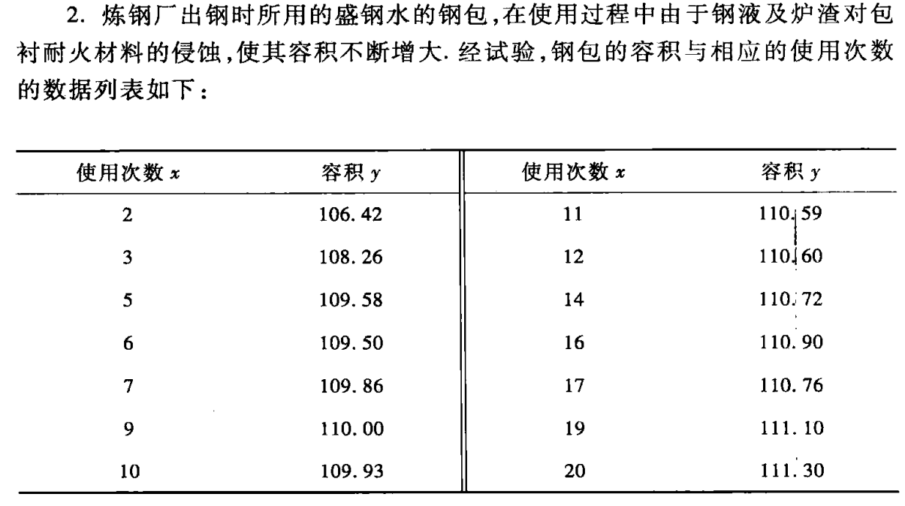
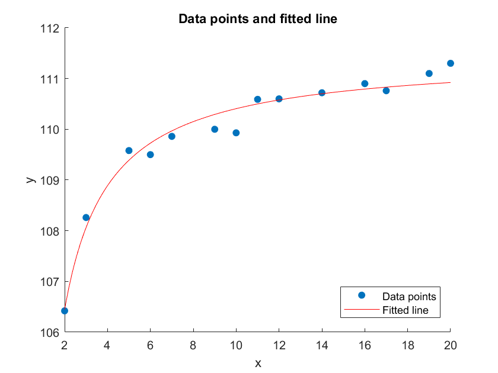

# 数值实验作业（第六章）

> 代码仓库：https://github.com/sylvanding/bit-numerical-analysis-hw

## P205. Q2



### 实验内容、步骤及结果

chap-6\leastSquaresMatrix.m: 

```matlab
function [A, b] = leastSquaresMatrix(x, y, m)

    assert(length(x) == length(y), 'The lengths of x and y must be the same.');

    n = length(x);

    A = zeros(m + 1, m + 1);
    b = zeros(m + 1, 1);

    for i = 1:m + 1

        for j = 1:m + 1

            for k = 1:n
                A(i, j) = A(i, j) + x(k) ^ (i - 1 + j - 1);
            end

        end

        for k = 1:n
            b(i) = b(i) + y(k) * x(k) ^ (i - 1);
        end

    end

end
```

chap-6\P205_Q2.m: 

```matlab
x = [2; 3; 5; 6; 7; 9; 10; 11; 12; 14; 16; 17; 19; 20];
y = [106.42; 108.26; 109.58; 109.50; 109.86; 110.00; 109.93; 110.59; 110.60; 110.72; 110.90; 110.76; 111.10; 111.30];
m = 1;

[A, b] = leastSquaresMatrix(1 ./ x, 1 ./ y, m);

coefficients = A \ b;

disp('y = x / ax + b');
disp('1/y = a + b/x');

disp('Coefficients:');
disp(coefficients);

a = coefficients(1);
b = coefficients(2);

% Plot the original data points
figure;
scatter(x, y, 'filled');
hold on;

% Plot the fitted line
x_fit = linspace(min(x), max(x), 100);
y_fit = x_fit ./ (a * x_fit + b);
plot(x_fit, y_fit, 'r');

xlabel('x');
ylabel('y');
title('Data points and fitted line');
legend('Data points', 'Fitted line');
hold off;
```

```
>> P205_Q2
y = x / ax + b
1/y = a + b/x
Coefficients:
    0.0090
    0.0008
```

### 实验结果分析



用最小二乘求出的拟合函数（red line）较好地拟合在了数据点（blue points）的附近。

## 补充代码

### chap-6\leastSquaresMatrix_Func.m

```matlab
function [A, b] = leastSquaresMatrix_Func(H, g, int_a, int_b)
    % Number of basis functions
    n = length(H);

    % Initialize A and b
    A = zeros(n, n);
    b = zeros(n, 1);

    % Compute matrix A
    for i = 1:n

        for j = 1:n
            A(i, j) = integral(@(x) H{i}(x) .* H{j}(x), int_a, int_b, 'ArrayValued', true);
        end

    end

    % Compute vector b
    for i = 1:n
        b(i) = integral(@(x) H{i}(x) .* g(x), int_a, int_b, 'ArrayValued', true);
    end

end
```

### chap-6\P203_Q1.m

```matlab
x = [1.36; 1.49; 1.73; 1.81; 1.95; 2.16; 2.28; 2.48];
y = [14.094; 15.069; 16.844; 17.378; 18.435; 19.949; 20.963; 22.495];
m = 1;

[A, b] = leastSquaresMatrix(x, y, m);

coefficients = A \ b;

disp('x:');
disp(x);

disp('y:');
disp(y);

disp('m:');
disp(m);

disp('A:');
disp(A);

disp('b:');
disp(b);

disp('Coefficients:');
disp(coefficients);
```

### chap-6\P203_Q2.m

```matlab
x = [1; 3; 4; 5; 6; 7; 8; 9; 10];
y = [10; 5; 4; 2; 1; 1; 2; 3; 4];
m = 2;

[A, b] = leastSquaresMatrix(x, y, m);

coefficients = A \ b;

disp('x:');
disp(x);

disp('y:');
disp(y);

disp('m:');
disp(m);

disp('A:');
disp(A);

disp('b:');
disp(b);

disp('Coefficients:');
disp(coefficients);
```

### chap-6\P203_Q4.m

```matlab
x = [19; 25; 31; 38; 44];
y = [19.0; 32.3; 49.0; 73.3; 97.8];
m = 1;

[A, b] = leastSquaresMatrix(x .^ 2, y, m);

coefficients = A \ b;

disp('y = a + bx^2');

disp('x:');
disp(x);

disp('y:');
disp(y);

disp('m:');
disp(m);

disp('A:');
disp(A);

disp('b:');
disp(b);

disp('Coefficients:');
disp(coefficients);
```

### chap-6\P203_Q6.m

```matlab
x = [1; 2; 3; 4; 5; 6; 7; 8];
y = [15.3; 20.5; 27.4; 36.6; 49.1; 65.6; 87.87; 117.6];
m = 1;

[A, b] = leastSquaresMatrix(x, log(y), m);

coefficients = A \ b;

disp('y = a*exp(bx)');
disp('ln(y) = ln(a) + bx');

disp('x:');
disp(x);

disp('y:');
disp(y);

disp('log(y)');
disp(log(y));

disp('m:');
disp(m);

disp('A:');
disp(A);

disp('b:');
disp(b);

disp('Coefficients:');
disp(coefficients);

a = exp(coefficients(1));
b = coefficients(2);

disp('a:');
disp(a);

disp('b:');
disp(b);
```

### chap-6\P203_Q7.m

```matlab
x = [1; 2; 3; 4; 6; 8; 10; 12; 14; 16];
y = [4.00; 6.41; 8.01; 8.79; 9.53; 9.86; 10.33; 10.42; 10.53; 10.61];
m = 1;

[A, b] = leastSquaresMatrix(1 ./ x, 1 ./ y, m);

coefficients = A \ b;

disp('y = x / ax + b');
disp('1/y = a + b/x');

disp('x:');
disp(x);

disp('y:');
disp(y);

disp('1/x');
disp(1 ./ x);

disp('1/y');
disp(1 ./ y);

disp('m:');
disp(m);

disp('A:');
disp(A);

disp('b:');
disp(b);

disp('Coefficients:');
disp(coefficients);
```

### chap-6\P203_Q12.m

```matlab
% Define basis functions
H = {@(x) 1, @(x) x .^ 2, @(x) x .^ 4};

% Define target function
g = @(x) cos(x);

% Define integration interval
int_a = -pi / 2;
int_b = pi / 2;

[A, b] = leastSquaresMatrix_Func(H, g, int_a, int_b);

coefficients = A \ b;

disp('A:');
disp(A);

disp('b:');
disp(b);

disp('Coefficients:');
disp(coefficients);
```

### P203_outputs.txt

```
>> P203_Q1
x:
    1.3600
    1.4900
    1.7300
    1.8100
    1.9500
    2.1600
    2.2800
    2.4800


y:
   14.0940
   15.0690
   16.8440
   17.3780
   18.4350
   19.9490
   20.9630
   22.4950


m:
     1


A:
    8.0000   15.2600
   15.2600   30.1556


b:
  145.2270
  284.8363


Coefficients:
    3.9161
    7.4639


>> P203_Q2
x:
     1
     3
     4
     5
     6
     7
     8
     9
    10


y:
    10
     5
     4
     2
     1
     1
     2
     3
     4


m:
     2


A:
           9          53         381
          53         381        3017
         381        3017       25317


b:
          32
         147
        1025


Coefficients:
   13.4597
   -3.6053
    0.2676


>> P203_Q4
y = a + bx^2
x:
    19
    25
    31
    38
    44


y:
   19.0000
   32.3000
   49.0000
   73.3000
   97.8000


m:
     1


A:
           5        5327
        5327     7277699


b:
   1.0e+05 *

    0.0027
    3.6932


Coefficients:
    0.9726
    0.0500


>> P203_Q6
y = a*exp(bx)
ln(y) = ln(a) + bx
x:
     1
     2
     3
     4
     5
     6
     7
     8


y:
   15.3000
   20.5000
   27.4000
   36.6000
   49.1000
   65.6000
   87.8700
  117.6000


log(y)
    2.7279
    3.0204
    3.3105
    3.6000
    3.8939
    4.1836
    4.4759
    4.7673


m:
     1


A:
     8    36
    36   204


b:
   29.9795
  147.1406


Coefficients:
    2.4367
    0.2913


a:
   11.4358


b:
    0.2913


>> P203_Q7
y = x / ax + b
1/y = a + b/x
x:
     1
     2
     3
     4
     6
     8
    10
    12
    14
    16


y:
    4.0000
    6.4100
    8.0100
    8.7900
    9.5300
    9.8600
   10.3300
   10.4200
   10.5300
   10.6100


1/x
    1.0000
    0.5000
    0.3333
    0.2500
    0.1667
    0.1250
    0.1000
    0.0833
    0.0714
    0.0625


1/y
    0.2500
    0.1560
    0.1248
    0.1138
    0.1049
    0.1014
    0.0968
    0.0960
    0.0950
    0.0943


m:
     1


A:
   10.0000    2.6923
    2.6923    1.4930


b:
    1.2330
    0.4586


Coefficients:
    0.0789
    0.1649


>> P203_Q12
A:
    3.1416    2.5839    3.8252
    2.5839    3.8252    6.7417
    3.8252    6.7417   12.9380


b:
    2.0000
    0.9348
    0.9585


Coefficients:
    0.9996
   -0.4964
    0.0372
```