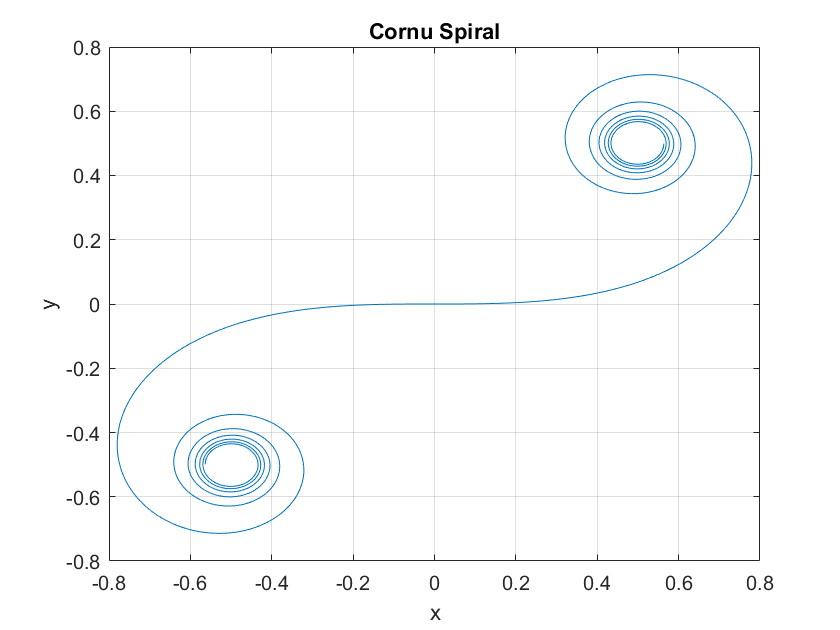

# 数值实验作业（第七章）

> 代码仓库：https://github.com/sylvanding/bit-numerical-analysis-hw

## P258. Q9

分别用$n=10$的复化梯形公式和复化Simpson公式计算积分

$$
I=\int_0^1 \mathrm{e}^{-x^2} \mathrm{~d} x
$$

的近似值，并估计误差。

### 实验内容、步骤及结果

chap-7\composite_int.m: 

```matlab
function result = composite_int(f, a, b, method, n)
    % Composite integration using trapezoidal or Simpson's rule.
    %
    % Args:
    %   f:      Function handle to be integrated.
    %   a:      Lower limit of integration.
    %   b:      Upper limit of integration.
    %   method: Integration method ('trapezoidal' or 'simpson').
    %   n:      Number of subintervals.
    %
    % Returns:
    %   result: The approximate value of the definite integral.

    h = (b - a) / n;
    x = a:h:b; % Generate equally spaced points

    switch lower(method)
        case 'trapezoidal'
            result = h / 2 * (f(x(1)) + 2 * sum(f(x(2:end - 1))) + f(x(end)));

        case 'simpson'

            if mod(n, 2) ~= 0
                error('Number of subintervals (n) must be even for Simpson''s rule.');
            end

            result = h / 3 * (f(x(1)) + 4 * sum(f(x(2:2:end - 1))) + 2 * sum(f(x(3:2:end - 2))) + f(x(end)));

        otherwise
            error('Invalid integration method. Use "trapezoidal" or "simpson".');
    end

end
```

chap-7\P258_Q9.m: 

```matlab
% Define the function to be integrated
f = @(x) exp(-x .^ 2);

% Integration limits
a = 0;
b = 1;

% Number of subintervals
n = 10; % Try different values of n

% Calculate the integral using the trapezoidal rule
result_trapezoidal = composite_int(f, a, b, 'trapezoidal', n);
fprintf('Trapezoidal rule result: %f\n', result_trapezoidal);

% Calculate the integral using Simpson's rule
result_simpson = composite_int(f, a, b, 'simpson', n);
fprintf('Simpson''s rule result: %f\n', result_simpson);

% Calculate the exact value of the integral
exact_value = integral(f, a, b);

% Calculate the truncation error for the trapezoidal rule
error_trapezoidal = abs(exact_value - result_trapezoidal);
fprintf('Trapezoidal rule truncation error: %e\n', error_trapezoidal);

% Calculate the truncation error for Simpson's rule
error_simpson = abs(exact_value - result_simpson);
fprintf('Simpson''s rule truncation error: %e\n', error_simpson);

% Define the second derivative of the function
f2 = @(x) -2 * exp(-x .^ 2) + 4 * x .^ 2 .* exp(-x .^ 2);

% Calculate the maximum value of the second derivative on [a, b]
x_vals = linspace(a, b, 1000);
max_f2 = max(abs(f2(x_vals)));

% Estimate the error for the trapezoidal rule
error_est_trapezoidal = ((b - a) ^ 3 / (12 * n ^ 2)) * max_f2;
fprintf('Estimated trapezoidal rule error: %e\n', error_est_trapezoidal);

% Define the fourth derivative of the function for Simpson's rule error estimation
f4 = @(x) (16 * x .^ 4 - 48 * x .^ 2 + 12) .* exp(-x .^ 2);

% Calculate the maximum value of the fourth derivative on [a, b]
max_f4 = max(abs(f4(x_vals)));

% Estimate the error for Simpson's rule
error_est_simpson = ((b - a) ^ 5 / (180 * n ^ 4)) * max_f4;
fprintf('Estimated Simpson''s rule error: %e\n', error_est_simpson);
```

### 实验结果分析

```
>> P258_Q9
Trapezoidal rule result: 0.746211
Simpson's rule result: 0.746825
Trapezoidal rule truncation error: 6.133367e-04
Simpson's rule truncation error: 8.154420e-07
Estimated trapezoidal rule error: 1.666667e-03
Estimated Simpson's rule error: 6.666667e-06
```

## P258. Q13

试用梯形公式的逐次分半算法计算下列积分：

$$
(1) && \int_0^\pi \frac{\mathrm{d} x}{x+\cos x} \\
(2) && \int_0^1 \frac{\mathrm{~d} x}{1+x^3}
$$

要求误差不超过$\epsilon =3\times 10^{-4}$.

### 实验内容、步骤及结果

chap-7\adaptive_int.m

```matlab
function [result, error_est] = adaptive_int(f, a, b, method, tolerance)
    % Adaptive integration using successive interval halving.
    %
    % Args:
    %   f:          Function handle to be integrated.
    %   a:          Lower limit of integration.
    %   b:          Upper limit of integration.
    %   method:     Integration method ('trapezoidal', 'simpson', or 'romberg').
    %   tolerance:  Desired error tolerance.
    %
    % Returns:
    %   result:     The approximate value of the definite integral.
    %   error_est:  Estimated error of the approximation.

    % Initial integral approximation
    switch lower(method)
        case 'trapezoidal'
            I_old = (b - a) * (f(a) + f(b)) / 2;
        case 'simpson'
            I_old = (b - a) * (f(a) + 4 * f((a + b) / 2) + f(b)) / 6;
        case 'romberg'
            R(1, 1) = (b - a) * (f(a) + f(b)) / 2; % Initialize Romberg table
            I_old = R(1, 1);
        otherwise
            error('Invalid integration method. Use "trapezoidal", "simpson", or "romberg".');
    end

    n = 1; % Initial number of intervals
    error_est = Inf;

    n = 2 * n;
    h = (b - a) / n;

    while error_est > tolerance
        x = a:h:b;

        switch lower(method)
            case 'trapezoidal'
                I_new = 0.5 * I_old + h * sum(f(x(2:2:end - 1)));
                error_est = abs(I_new - I_old) / 3;
                n = 2 * n;
                h = (b - a) / n;
            case 'simpson'
                I_new = (h / 3) * (f(a) + f(b) + 2 * (sum(f(x(2:2:end - 2)))) + 4 * (sum(f(x(1:2:end - 1)))));
                error_est = abs(I_new - I_old) / 15;
                n = 2 * n;
                h = (b - a) / n;
            case 'romberg'
                h = (b - a) / 2 ^ (n - 1);

                % Improved Trapezoidal Rule
                sum_f = 0;

                for j = 1:2 ^ (n - 2)
                    sum_f = sum_f + f(a + (2 * j - 1) * h);
                end

                R(n, 1) = 0.5 * R(n - 1, 1) + h * sum_f;

                % Extrapolation
                for j = 2:n
                    R(n, j) = (4 ^ (j - 1) * R(n, j - 1) - R(n - 1, j - 1)) / (4 ^ (j - 1) - 1);
                end

                I_new = R(n, n);
                error_est = abs(R(n, n) - R(n - 1, n - 1)); % More accurate error estimate

                n = n + 1;
            otherwise
                error('Invalid integration method.');
        end

        I_old = I_new;

    end

    result = I_new;

end
```

chap-7\P258_Q13_1/2.m

```matlab
f = @(x) 1 ./ (x + cos(x));
a = 0;
b = pi;

% f = @(x) 1 ./ (1 + x .^ 3);
% a = 0;
% b = 1;

tolerance = 3e-4;

[result_trap, error_trap] = adaptive_int(f, a, b, 'trapezoidal', tolerance);
fprintf('Trapezoidal: Result = %f, Error = %f\n', result_trap, error_trap);

[result_simp, error_simp] = adaptive_int(f, a, b, 'simpson', tolerance);
fprintf('Simpson: Result = %f, Error = %f\n', result_simp, error_simp);

[result_romb, error_romb] = adaptive_int(f, a, b, 'romberg', tolerance);
fprintf('Romberg: Result = %f, Error = %f\n', result_romb, error_romb);

% Calculate the truncation error
true_value = integral(f, a, b);
truncation_error_trap = abs(true_value - result_trap);
truncation_error_simp = abs(true_value - result_simp);
truncation_error_romb = abs(true_value - result_romb);

fprintf('Trapezoidal: Truncation Error = %f\n', truncation_error_trap);
fprintf('Simpson: Truncation Error = %f\n', truncation_error_simp);
fprintf('Romberg: Truncation Error = %f\n', truncation_error_romb);
```

### 实验结果分析

```
>> P258_Q13_1
Trapezoidal: Result = 2.043220, Error = 0.000157
Simpson: Result = 2.046333, Error = 0.000218
Romberg: Result = 2.043078, Error = 0.000289
Trapezoidal: Truncation Error = 0.000157
Simpson: Truncation Error = 0.003270
Romberg: Truncation Error = 0.000015

>> P258_Q13_2
Trapezoidal: Result = 0.835405, Error = 0.000245
Simpson: Result = 0.918732, Error = 0.000138
Romberg: Result = 0.835649, Error = 0.000007
Trapezoidal: Truncation Error = 0.000244
Simpson: Truncation Error = 0.083083
Romberg: Truncation Error = 0.000000
```

## P258. Q14

用Romberg方法计算积分

$$
I=\int_0^4 \sqrt{1+\cos ^2 x} \mathrm{~d} x
$$

的近似值，要求误差不超过$10^{-2}$.

### 实验内容、步骤及结果

chap-7\P258_Q14.m

```matlab
f = @(x) sqrt(1 + cos(x) .^ 2);
a = 0;
b = 4;
tolerance = 1e-2;

[result_romb, error_romb] = adaptive_int(f, a, b, 'romberg', tolerance);
fprintf('Romberg: Result = %f, Error = %f\n', result_romb, error_romb);

% Calculate the truncation error
true_value = integral(f, a, b);
truncation_error_romb = abs(true_value - result_romb);

fprintf('Romberg: Truncation Error = %f\n', truncation_error_romb);
```

### 实验结果分析

```matlab
>> P258_Q14
Romberg: Result = 4.966675, Error = 0.001780
Romberg: Truncation Error = 0.000059
>> 
```

## P260. Q1

考纽螺线的形状像钟表的发条，也称回旋曲线，它在直角坐标系中的参数方程为

$$
\left\{\begin{array}{l}
x(s)=\int_0^s \cos \frac{1}{2} a t^2 \mathrm{~d} t \\
y(s)=\int_0^s \sin \frac{1}{2} a t^2 \mathrm{~d} t
\end{array}\right.
$$

曲线关于原点对称。取$a=1$，参数$s$变化范围是$[-5,5]$，容许误差限分别是$10^{-6}$和$10^{-10}$. 选取适当的节点个数，利用数值积分方法计算曲线上点的坐标，并画出曲线的图形。

### 实验内容、步骤及结果

chap-7\P260_Q1.m

```matlab
% Define the Cornu spiral functions
a = 1;
tolerance_x = 1e-6;
tolerance_y = 1e-10;

% Define the integrand functions for x(s) and y(s)
fx = @(s) cos(pi * s .^ 2/2);
fy = @(s) sin(pi * s .^ 2/2);

% Define the range for s
s_range = linspace(-5, 5, 1000);

% Initialize arrays to store the results
x_vals = zeros(size(s_range));
y_vals = zeros(size(s_range));

% Compute the values of x(s) and y(s) using adaptive integration
for i = 1:length(s_range)
    s = s_range(i);
    x_vals(i) = adaptive_int(fx, 0, s, 'trapezoidal', tolerance_x);
    y_vals(i) = adaptive_int(fy, 0, s, 'trapezoidal', tolerance_y);
end

% Plot the Cornu spiral
figure;
plot(x_vals, y_vals);
title('Cornu Spiral');
xlabel('x');
ylabel('y');
grid on;
```

### 实验结果分析



$s$变化范围是$[-5,5]$，$s$均匀分为$1000$份。使用复化梯形公式的半分法估计积分，计算结果如上。