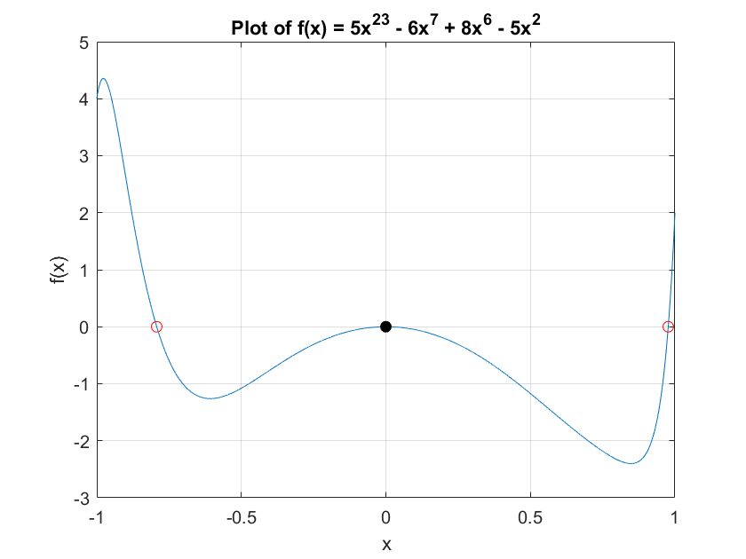

# 数值实验作业（第八章）

> 代码仓库：https://github.com/sylvanding/bit-numerical-analysis-hw

## P290. Q1


### 实验内容、步骤及结果

chap-8\iterative_root_finding.m

```matlab
function [result, n, error] = iterative_root_finding(phi, x0, tolerance, method, varargin)
    % Iterative methods for finding the root of a function.

    % Inputs:
    %   phi:        Iteration function handle (@(x) ...).
    %   x0:         Initial guess.
    %   tolerance:  Error tolerance.
    %   method:     'simple' or 'newton'.
    %   varargin:   Variable arguments depending on the method:
    %               For 'simple':
    %                   acceleration: 'none', 'steffensen', or 'lambda'.
    %                   lambda (optional):  Relaxation parameter for 'lambda' acceleration.
    %               For 'newton':
    %                   f:          Function handle for Newton's method.
    %                   df (optional): Derivative of f. If not provided, secant method is used.

    % Outputs:
    %   result:     Approximated root.
    %   n:          Number of iterations.
    %   error:      Error estimate.

    max_iterations = 1000;
    n = 0;
    x = x0;

    switch lower(method)
        case 'simple'
            acceleration = varargin{1};

            if strcmpi(acceleration, 'lambda')
                lambda = varargin{2};
            end

            while true
                n = n + 1;
                x_old = x;

                switch lower(acceleration)
                    case 'none'
                        x = phi(x);
                    case 'steffensen'
                        x1 = phi(x);
                        x2 = phi(x1);
                        x = x - (x1 - x) ^ 2 / (x2 - 2 * x1 + x);
                    case 'lambda'
                        x = lambda * phi(x) + (1 - lambda) * x;
                end

                error = abs(x - x_old);

                if error < tolerance || n >= max_iterations
                    break;
                end

            end

        case 'newton'
            f = varargin{1};

            if length(varargin) > 1
                df = varargin{2};
                phi = @(x) x - f(x) / df(x); % Newton's method

                while true
                    n = n + 1;
                    x_old = x;
                    x = phi(x);
                    error = abs(x - x_old);

                    if error < tolerance || n >= max_iterations
                        break;
                    end

                end

            else
                x_prev = x0(1);
                x = x0(2);
                phi = @(x_curr, x_prev) x_curr - f(x_curr) * (x_curr - x_prev) / (f(x_curr) - f(x_prev)); % Secant method

                while true
                    n = n + 1;
                    x_next = phi(x, x_prev);
                    error = abs(x_next - x);

                    if error < tolerance || n >= max_iterations
                        break;
                    end

                    x_prev = x;
                    x = x_next;

                end

            end

        otherwise
            error('Invalid method specified.');
    end

    if n >= max_iterations
        error('Method did not converge within maximum iterations.');
    end

    result = x;

end
```

chap-8\P290_Q1.m

```matlab
f = @(x) x .^ 2 + sin(10 * x) - 1;
x = linspace(-2, 2, 10000);
y = f(x);

% Plot the function
figure;
plot(x, y);
xlabel('x');
ylabel('f(x)');
title('Plot of f(x) = x^2 + sin(10x) - 1');
grid on;
ylim([-1 1]);

hold on;

r_num = 1;

for i = 1:length(x) - 1
    a = x(i);
    b = x(i + 1);

    if f(a) * f(b) > 0
        continue;
    elseif f(a) * f(b) < 0
        c = (a + b) / 2;
        % Newton's method with secant (no df provided):
        [root, n, error] = iterative_root_finding([], [a, b], 1e-6, 'newton', f);
        plot(root, f(root), 'ro');
        fprintf('Approximated root No.%d: %f\n', r_num, root);
        r_num = r_num + 1;
    elseif f(a) == 0
        plot(a, f(a), 'bo');
    end

end

hold off;
```

### 实验结果分析


```
>> P290_Q1
Approximated root No.1: -1.414209
Approximated root No.2: -1.356265
Approximated root No.3: -0.951883
Approximated root No.4: -0.551333
Approximated root No.5: -0.412101
Approximated root No.6: 0.137591
Approximated root No.7: 0.183038
Approximated root No.8: 0.684372
Approximated root No.9: 0.928678
Approximated root No.10: 1.208723
```

图中红色空心圆圈即为遍历x区间所找到的函数零点。以下实验图例均保持一致。

## P290. Q2


### 实验内容、步骤及结果

chap-8\P290_Q2.m

```matlab
% Simple iteration with no acceleration:
phi = @(x) exp(-x);
[result, n, error] = iterative_root_finding(phi, .5, 1e-8, 'simple', 'none');

fprintf('Simple iteration with no acceleration:\n');
fprintf('Approximated root: %f\n', result);
fprintf('Number of iterations: %d\n', n);
fprintf('Error estimate: %e\n\n', error);

% Compare the results
f = @(x) x - exp(-x);
root_fzero = fzero(f, [0, 1]);
fprintf('Root using fzero: %f\n', root_fzero);
fprintf('Difference between methods: %e\n', abs(result - root_fzero));

% Simple iteration with lambda acceleration:
[result, n, error] = iterative_root_finding(phi, .5, 1e-8, 'simple', 'lambda', 0.625);

fprintf('\nSimple iteration with lambda acceleration:\n');
fprintf('Approximated root: %f\n', result);
fprintf('Number of iterations: %d\n', n);
fprintf('Error estimate: %e\n\n', error);

% Compare the results
fprintf('Root using fzero: %f\n', root_fzero);
fprintf('Difference between methods: %e\n', abs(result - root_fzero));
```

### 实验结果分析

```
>> P290_Q2
Simple iteration with no acceleration:
Approximated root: 0.567143
Number of iterations: 30
Error estimate: 7.733198e-09

Root using fzero: 0.567143
Difference between methods: 2.798615e-09

Simple iteration with lambda acceleration:

Approximated root: 0.567143
Number of iterations: 5
Error estimate: 4.740185e-09

Root using fzero: 0.567143
Difference between methods: 9.938261e-11
```

相比于简单迭代算法（30次迭代），使用加速收敛的迭代算法大幅提升了收敛速度（5次迭代），且精度更高。

## P290. Q3

先作图分析下列方程的有根区间，编写Newton法和弦截法的程序，求解下列方程：


### 实验内容、步骤及结果

chap-8\P290_Q3_1.m

```matlab
f = @(x) 5 * x .^ 23 - 6 * x .^ 7 + 8 * x .^ 6 - 5 * x .^ 2;
x = linspace(-1, 1, 10000);
y = f(x);

% Plot the function
figure;
plot(x, y);
xlabel('x');
ylabel('f(x)');
title('Plot of f(x) = 5x^{23} - 6x^{7} + 8x^{6} - 5x^{2}');
grid on;

hold on;

r_num = 1;

for i = 1:length(x) - 1
    a = x(i);
    b = x(i + 1);

    if f(a) * f(b) > 0
        continue;
    elseif f(a) * f(b) < 0
        c = (a + b) / 2;
        % Newton's method with secant (no df provided):
        [root, ~, ~] = iterative_root_finding([], [a, b], 1e-6, 'newton', f);
        plot(root, f(root), 'ro');
        fprintf('Approximated root No.%d: %f\n', r_num, root);
        r_num = r_num + 1;
    elseif f(a) == 0
        plot(a, f(a), 'bo');
    end

end

% Newton's method with secant (no df provided):
[root, ~, ~] = iterative_root_finding([], [-1e-1, 1/2], 1e-6, 'newton', f);
plot(root, f(root), 'ko', 'MarkerFaceColor', 'k');
fprintf('Approximated root No.%d: %f\n', r_num, root);

hold off;
```

chap-8\P290_Q3_2.m

```matlab
f = @(x) exp(-2 * x + 6) .* cos(10 * x) + exp(-3 * x) .* sin(2 * x) - exp(6);
x = linspace(-1, 1, 10000);
y = f(x);

% Plot the function
figure;
plot(x, y);
xlabel('x');
ylabel('f(x)');
title('Plot of f(x) = exp(-2x + 6)cos(10x) + exp(-3x)sin(2x) - exp(6)');
grid on;

hold on;

r_num = 1;

for i = 1:length(x) - 1
    a = x(i);
    b = x(i + 1);

    if f(a) * f(b) > 0
        continue;
    elseif f(a) * f(b) < 0
        c = (a + b) / 2;
        % Newton's method with secant (no df provided):
        [root, ~, ~] = iterative_root_finding([], [a, b], 1e-6, 'newton', f);
        plot(root, f(root), 'ro');
        fprintf('Approximated root No.%d: %f\n', r_num, root);
        r_num = r_num + 1;
    elseif f(a) == 0
        plot(a, f(a), 'bo');
    end

end

hold off;
```

### 实验结果分析



```
>> P290_Q3_1
Approximated root No.1: -0.792745
Approximated root No.2: 0.976776
Approximated root No.3: -0.000002
```

很明显$x=0$是目标函数的一个根，用弦截法求解需要合理设置启动点$x_0$和$x_1$，否则无法准确收敛到$0$.


```
>> P290_Q3_2
Approximated root No.1: -0.762936
Approximated root No.2: -0.508613
Approximated root No.3: -0.038869
Approximated root No.4: -0.000000
```


## 补充代码

### chap-8\bisectionMethod.m

```matlab
function [result, k, process] = bisectionMethod(f, a0, b0, tolerance)
    % Implements the bisection method to find a root of the function f within the interval [a0, b0].

    % Input:
    %   f:          The function handle for which to find a root.
    %   a0:         The left endpoint of the initial interval.
    %   b0:         The right endpoint of the initial interval.
    %   tolerance:  The desired tolerance (stopping criterion).

    % Output:
    %   result:    The approximate root of the function.
    %   k:         The number of iterations performed.
    %   process:   A matrix storing the values of ak, (ak+bk)/2, bk, f(ak), f((ak+bk)/2), and f(bk) at each iteration.

    % Check if the interval brackets a root
    if f(a0) * f(b0) > 0
        error('Function values at the interval endpoints must have opposite signs.');
    end

    % Calculate the number of iterations needed
    k = ceil(log2((b0 - a0) / tolerance));

    % Initialize the process matrix
    process = zeros(k, 6);

    % Bisection method iterations
    a = a0;
    b = b0;

    for i = 1:k
        c = (a + b) / 2;
        process(i, :) = [a, c, b, f(a), f(c), f(b)];

        if f(c) == 0
            result = c;
            return;
        elseif f(a) * f(c) < 0
            b = c;
        else
            a = c;
        end

    end

    result = (a + b) / 2;

end
```

### chap-8\P288_Q1_1.m

```matlab
f = @(x) x - log(x) - 2;
a0 = 2;
b0 = 4;
tolerance = 1e-5;

[root, iterations, process_data] = bisectionMethod(f, a0, b0, tolerance);

fprintf('Approximate root: %f\n', root);
fprintf('Number of iterations: %d\n', iterations);

% Compare the results
root_fzero = fzero(f, [a0, b0]);
fprintf('Root using fzero: %f\n', root_fzero);
fprintf('Difference between methods: %e\n', abs(root - root_fzero));

disp('Process data (a, c, b, f(a), f(c), f(b)):');
disp(process_data);
```

### chap-8\P288_Q2.m

```matlab
% Simple iteration with no acceleration:
phi = @(x) 1 + 1 / x ^ 2;
[result, n, error] = iterative_root_finding(phi, 1.5, (1e-4) / 2, 'simple', 'none');

fprintf('Simple iteration with no acceleration:\n');
fprintf('Approximated root: %f\n', result);
fprintf('Number of iterations: %d\n', n);
fprintf('Error estimate: %e\n\n', error);

% Compare the results
f = @(x) x ^ 3 - x ^ 2 - 1;
root_fzero = fzero(f, [1, 2]);
fprintf('Root using fzero: %f\n', root_fzero);
fprintf('Difference between methods: %e\n', abs(result - root_fzero));
```

### chap-8\P288_Q3_1.m

```matlab
% Simple iteration with no acceleration:
phi = @(x) cos(x);
[result, n, error] = iterative_root_finding(phi, 0.5, 1e-5, 'simple', 'none');

fprintf('Simple iteration with no acceleration:\n');
fprintf('Approximated root: %f\n', result);
fprintf('Number of iterations: %d\n', n);
fprintf('Error estimate: %e\n\n', error);

% Compare the results
f = @(x) x - cos(x);
root_fzero = fzero(f, [0, 1]);
fprintf('Root using fzero: %f\n', root_fzero);
fprintf('Difference between methods: %e\n', abs(result - root_fzero));
```

### chap-8\P288_Q7_2.m

```matlab
% Simple iteration with no acceleration:
phi = @(x) 4 + 2 * cos(x) / 3;
[result, n, error] = iterative_root_finding(phi, 4, (1e-5) / 2, 'simple', 'none');

fprintf('Simple iteration with no acceleration:\n');
fprintf('Approximated root: %f\n', result);
fprintf('Number of iterations: %d\n', n);
fprintf('Error estimate: %e\n\n', error);

% Compare the results
f = @(x) 12 - 3 * x + 2 * cos(x);
root_fzero = fzero(f, [3, 5]);
fprintf('Root using fzero: %f\n', root_fzero);
fprintf('Difference between methods: %e\n', abs(result - root_fzero));
```

### chap-8\P288_Q10_1.m

```matlab
% Newton's method:
f = @(x) x - log(x) - 2;
df = @(x) 1 - 1 / x;
a = 1/8;
b = 1;
[result, n, error] = iterative_root_finding([], a, 1e-6, 'newton', f, df);

fprintf('f(a) = %f\n', f(a));
fprintf('f(b) = %f\n', f(b));

fprintf('\nNewton''s method:\n');
fprintf('Approximated root: %f\n', result);
fprintf('Number of iterations: %d\n', n);
fprintf('Error estimate: %e\n\n', error);

% Compare the results
root_fzero = fzero(f, [a, b]);
fprintf('Root using fzero: %f\n', root_fzero);
fprintf('Difference between methods: %e\n', abs(result - root_fzero));
```

### chap-8\P288_Q16_1.m

```matlab
% Newton's method with secant (no df provided):
f = @(x) x - log(x) - 2;
a = 1/8;
b = 1;
[result, n, error] = iterative_root_finding([], [a, b], 1e-5, 'newton', f);

fprintf('f(a) = %f\n', f(a));
fprintf('f(b) = %f\n', f(b));

fprintf('\nNewton''s method with secant (no df provided):\n');
fprintf('Approximated root: %f\n', result);
fprintf('Number of iterations: %d\n', n);
fprintf('Error estimate: %e\n\n', error);

% Compare the results
root_fzero = fzero(f, [a, b]);
fprintf('Root using fzero: %f\n', root_fzero);
fprintf('Difference between methods: %e\n', abs(result - root_fzero));
```

### chap-8\outputs.txt

```
>> P288_Q1_1
Approximate root: 3.146191
Number of iterations: 18
Root using fzero: 3.146193
Difference between methods: 2.577310e-06
Process data (a, c, b, f(a), f(c), f(b)):
    2.0000    3.0000    4.0000   -0.6931   -0.0986    0.6137
    3.0000    3.5000    4.0000   -0.0986    0.2472    0.6137
    3.0000    3.2500    3.5000   -0.0986    0.0713    0.2472
    3.0000    3.1250    3.2500   -0.0986   -0.0144    0.0713
    3.1250    3.1875    3.2500   -0.0144    0.0283    0.0713
    3.1250    3.1562    3.1875   -0.0144    0.0069    0.0283
    3.1250    3.1406    3.1562   -0.0144   -0.0038    0.0069
    3.1406    3.1484    3.1562   -0.0038    0.0015    0.0069
    3.1406    3.1445    3.1484   -0.0038   -0.0011    0.0015
    3.1445    3.1465    3.1484   -0.0011    0.0002    0.0015
    3.1445    3.1455    3.1465   -0.0011   -0.0005    0.0002
    3.1455    3.1460    3.1465   -0.0005   -0.0001    0.0002
    3.1460    3.1462    3.1465   -0.0001    0.0000    0.0002
    3.1460    3.1461    3.1462   -0.0001   -0.0001    0.0000
    3.1461    3.1462    3.1462   -0.0001   -0.0000    0.0000
    3.1462    3.1462    3.1462   -0.0000    0.0000    0.0000
    3.1462    3.1462    3.1462   -0.0000    0.0000    0.0000
    3.1462    3.1462    3.1462   -0.0000   -0.0000    0.0000


>> P288_Q2
Simple iteration with no acceleration:
Approximated root: 1.465556
Number of iterations: 17
Error estimate: 3.884410e-05


Root using fzero: 1.465571
Difference between methods: 1.509102e-05
>> P288_Q3_1
Simple iteration with no acceleration:
Approximated root: 0.739082
Number of iterations: 28
Error estimate: 8.252210e-06


Root using fzero: 0.739085
Difference between methods: 3.321437e-06
>> P288_Q7_2
Simple iteration with no acceleration:
Approximated root: 3.347403
Number of iterations: 8
Error estimate: 2.037798e-06


Root using fzero: 3.347403
Difference between methods: 3.214225e-07
>> P288_Q10_1
f(a) = 0.204442
f(b) = -1.000000

Newton's method:

Approximated root: 0.158594
Number of iterations: 4
Error estimate: 1.967226e-08


Root using fzero: 0.158594
Difference between methods: 1.415534e-15
>> P288_Q16_1
f(a) = 0.204442
f(b) = -1.000000

Newton's method with secant (no df provided):

Approximated root: 0.158594
Number of iterations: 11
Error estimate: 8.248879e-06


Root using fzero: 0.158594
Difference between methods: 8.252914e-06
```
