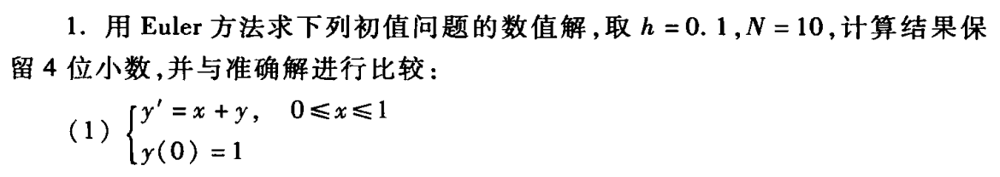
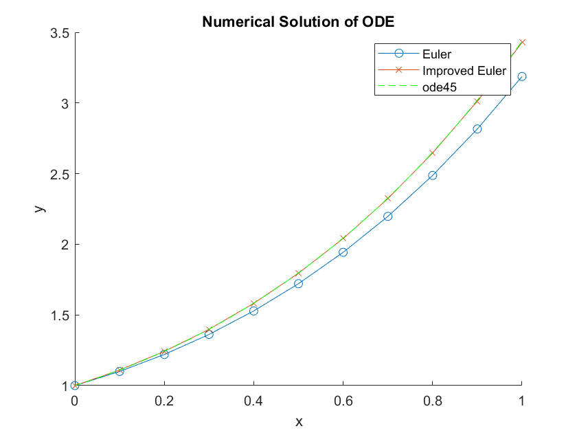
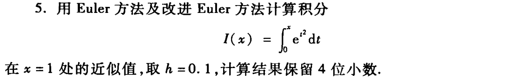
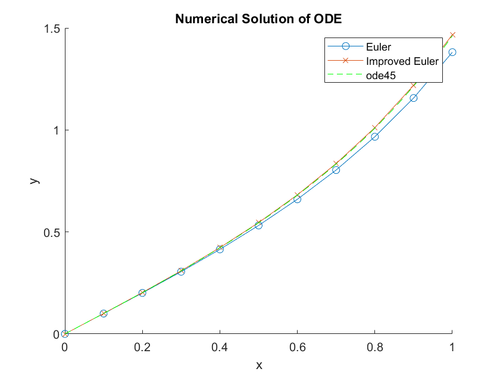

# 数值实验作业（第九章）

> 代码仓库：https://github.com/sylvanding/bit-numerical-analysis-hw

## P340. Q1_Q3_1



### 实验内容、步骤及结果

chap-9\solve_ode.m: 

```matlab
function [x, y] = solve_ode(f, y0, a, b, h, method)

    % Solves an ordinary differential equation (ODE) numerically using either the Euler method or the improved Euler method.

    % Inputs:
    %   f:      Function handle representing the ODE, y' = f(x, y)
    %   y0:     Initial condition y(a) = y0
    %   a:      Start of the interval
    %   b:      End of the interval
    %   h:      Step size
    %   method: 'euler' (default) or 'improved_euler'

    % Outputs:
    %   x:      Vector of x values
    %   y:      Vector of corresponding y values (numerical solution)

    if nargin < 6
        method = 'euler';
    end

    x = a:h:b;
    n = length(x);
    y = zeros(1, n);
    y(1) = y0;

    switch lower(method)
        case 'euler'

            for i = 1:n - 1
                y(i + 1) = y(i) + h * f(x(i), y(i));
            end

        case 'improved_euler'

            for i = 1:n - 1
                p = y(i) + h * f(x(i), y(i));
                q = y(i) + h * f(x(i + 1), p);
                y(i + 1) = (p + q) / 2;
            end

        otherwise
            error('Invalid method specified. Choose ''euler'' or ''improved_euler''.');
    end

end
```

chap-9\P340_Q1_Q3_1.m

```matlab
f = @(x, y) x + y;
y0 = 1;
a = 0;
b = 1;
h = 0.1;

% Solve using Euler method
[x_euler, y_euler] = solve_ode(f, y0, a, b, h, 'euler');

% Solve using improved Euler method
[x_improved_euler, y_improved_euler] = solve_ode(f, y0, a, b, h, 'improved_euler');

% Display results
disp('Euler Method:');
disp([x_euler' y_euler']);

disp('Improved Euler Method:');
disp([x_improved_euler' y_improved_euler']);

% Solve using ode45
[x_ode45, y_ode45] = ode45(f, [a b], y0);

% Plot Results (Optional):
hold on;
plot(x_euler, y_euler, '-o', x_improved_euler, y_improved_euler, '-x');
plot(x_ode45, y_ode45, 'g--');
hold off;
legend('Euler', 'Improved Euler', 'ode45');
xlabel('x');
ylabel('y');
title('Numerical Solution of ODE');
```

### 实验结果分析



```
>> P340_Q1_Q3_1
Euler Method:
         0    1.0000
    0.1000    1.1000
    0.2000    1.2200
    0.3000    1.3620
    0.4000    1.5282
    0.5000    1.7210
    0.6000    1.9431
    0.7000    2.1974
    0.8000    2.4872
    0.9000    2.8159
    1.0000    3.1875


Improved Euler Method:
         0    1.0000
    0.1000    1.1100
    0.2000    1.2421
    0.3000    1.3985
    0.4000    1.5818
    0.5000    1.7949
    0.6000    2.0409
    0.7000    2.3231
    0.8000    2.6456
    0.9000    3.0124
    1.0000    3.4282
```

改进Euler方法更加接近精确解。随着迭代步数增加，Euler方法越来越偏离精确解。

## P340. Q5



### 实验内容、步骤及结果

chap-9\P340_Q5.m

```matlab
f = @(x, y) exp(x .^ 2);
y0 = 0;
a = 0;
b = 1;
h = 0.1;

% Solve using Euler method
[x_euler, y_euler] = solve_ode(f, y0, a, b, h, 'euler');

% Solve using improved Euler method
[x_improved_euler, y_improved_euler] = solve_ode(f, y0, a, b, h, 'improved_euler');

% Display results
disp('Euler Method:');
disp([x_euler' y_euler']);

disp('Improved Euler Method:');
disp([x_improved_euler' y_improved_euler']);

% Solve using ode45
[x_ode45, y_ode45] = ode45(f, [a b], y0);

% Plot Results (Optional):
hold on;
plot(x_euler, y_euler, '-o', x_improved_euler, y_improved_euler, '-x');
plot(x_ode45, y_ode45, 'g--');
hold off;
legend('Euler', 'Improved Euler', 'ode45');
xlabel('x');
ylabel('y');
title('Numerical Solution of ODE');
```

### 实验结果分析



```
>> P340_Q5
Euler Method:
         0         0
    0.1000    0.1000
    0.2000    0.2010
    0.3000    0.3051
    0.4000    0.4145
    0.5000    0.5319
    0.6000    0.6603
    0.7000    0.8036
    0.8000    0.9668
    0.9000    1.1565
    1.0000    1.3813


Improved Euler Method:
         0         0
    0.1000    0.1005
    0.2000    0.2030
    0.3000    0.3098
    0.4000    0.4232
    0.5000    0.5461
    0.6000    0.6819
    0.7000    0.8352
    0.8000    1.0116
    0.9000    1.2189
    1.0000    1.4672
```